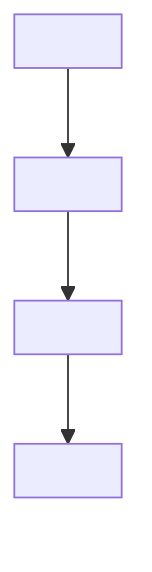
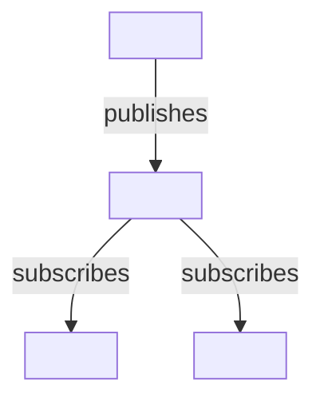

# Change Type Suggestions

Maps change types to their corresponding documentation formats.

| Change Type | Documentation Format |
|-------------|----------------------|
| New feature | README, CHANGELOG and other relevant sections |
| Bug fix | README, CHANGELOG and other relevant sections |
| Refactor | README, CHANGELOG and other relevant sections |
| Documentation update | README, CHANGELOG |
| API change | README, API docs, CHANGELOG and other relevant sections |
| Configuration change | README, Configuration guide, CONTRIBUTING.md, CHANGELOG and other relevant sections |
| Architecture update | README, CHANGELOG and other relevant sections |
| Testing change | README, Testing guide, CHANGELOG and other relevant sections |
| Other | README, CHANGELOG and other relevant sections |

## CHANGELOG Heading Convention

The project CHANGELOG organizes entries by scope, not by change type. Choose the heading based on what the change affects:

- **`### General`** -- Cross-cutting changes (new features, bug fixes, refactors, config changes, tooling updates, etc.).
- **`### Documentation`** -- Changes that only affect documentation files (READMEs, AGENTS.md, guides, etc.).

Each entry must include a Trello or Jira ticket link in the format `[#NNN](https://trello.com/c/XXX/NNN-description)` or `[#NNN](https://jira.example.com/browse/NNN)`. If no ticket exists, ask the user for one. Use `[No Ticket]` only as a last resort.

**Example:**

```markdown
## [Unreleased]

### Documentation

- Added AI-native documentation for SKILL.md usage [#421](https://trello.com/c/qrm3w6SX/421-description)

### General

- Removed bandit from CICD in favor of S ruleset from Ruff [No Ticket]
```

## Example Change Types

### New feature

In the README, you should add a new section for the feature where it fits best. The section should include a description of what the feature does, any prerequisites, usage instructions with command or code examples, and expected output.

````markdown
## <Feature Name>

<Brief description of what this feature does and when to use it.>

### Prerequisites

- <Prerequisite 1 (e.g., required tool, minimum version, or enabled setting)>
- <Prerequisite 2>

### Usage

```bash/python/shell/etc.
<command or code example>
```

**Expected output:**

```
<sample output>
```
````

If the feature introduces new configuration options or API surface, cross-link to the relevant documentation so readers can find the full details.

```markdown
> **See also:** [Configuration guide](docs/configuration.md) for new options introduced by this feature.
```

In the CHANGELOG, add a new entry under the appropriate heading. Use `### General` for cross-cutting features. Always include a ticket link.

```markdown
# Changelog

## [Unreleased]

### General

- Added <feature name>: <short description of what it enables> [#NNN](https://trello.com/c/XXX/NNN-description)
```

### Bug fix

In the README, if the fix changes previously documented behavior or removes a known limitation or workaround, update or remove the affected section so it reflects the corrected behavior.

```markdown
## <Affected Section Name>

<Updated description reflecting the corrected behavior. Remove any workaround instructions that are no longer needed.>
```

If the project maintains a known issues section and the bug was listed there, remove the resolved entry.

```markdown
## Known Issues

- ~~<Description of the resolved issue>~~ — Fixed in <version or PR reference>.
```

If the fix changes API responses, error codes, or other externally visible behavior, update the relevant API docs or reference sections to match the new behavior.

In the CHANGELOG, add a new entry under `### General`.

```markdown
# Changelog

## [Unreleased]

### General

- Fixed <what was broken> when <under what conditions> [#NNN](https://trello.com/c/XXX/NNN-description)
```

### Refactor

In the README, replace or redirect old section references to point to the new structure. Document what changed and where the updated content lives.

```markdown
## <Old Section Name>

> **Moved:** This section has been reorganized. See [<New Section Name>](#new-section-name) for the updated content.
```

````markdown
## <New Section Name>

<Description of the new structure or pattern, including how it differs from the previous approach.>

### Directory Structure

```
<project>/
  <new-directory>/
    <file-1>
    <file-2>
```
````

If the refactor changes directory layout, naming conventions, or how contributors interact with the codebase (e.g., moving modules, renaming entry points), update CONTRIBUTING.md so contributors know where to find things and how to follow the new patterns.

```markdown
## Project Structure

| Directory | Purpose |
|-----------|---------|
| `<new-directory>/` | <What this directory now contains and why it was moved.> |
```

In the CHANGELOG, add a new entry under `### General`.

```markdown
# Changelog

## [Unreleased]

### General

- Refactored <what was restructured> from <old pattern/location> to <new pattern/location> [#NNN](https://trello.com/c/XXX/NNN-description)
```

### Documentation update

In the README (or other affected documentation files), update the relevant sections in-place to reflect the new content. If sections were reorganized or renamed, add a redirect note at the old location so existing links and bookmarks remain useful.

```markdown
## <Renamed or Moved Section>

> **Note:** This section was previously called "<Old Name>". Content has been updated and moved to [<New Name>](#new-name).
```

After making changes, verify that all internal cross-references and table of contents entries still point to the correct headings. Fix any broken links.

```markdown
## Table of Contents

- [<Updated Section Name>](#updated-section-name)
- ...
```

In the CHANGELOG, add a new entry under `### Documentation`.

```markdown
# Changelog

## [Unreleased]

### Documentation

- Updated <which docs / sections> to reflect <what changed> [#NNN](https://trello.com/c/XXX/NNN-description)
```

### API change

In the README, update the API overview or usage section if it references the changed endpoint, method, or parameters so readers see the current interface.

````markdown
## API Usage

To <perform action>, call the `<METHOD>` endpoint:

```bash
curl -X <METHOD> <base-url>/<new-endpoint> \
  -H "Authorization: Bearer $TOKEN" \
  -d '{"<param>": "<value>"}'
```
````

In the API docs (or the API section of the README if no dedicated docs exist), update the endpoint reference with the current path, method, request/response schema, authentication requirements, and error codes.

```markdown
## Endpoints

### `<METHOD> /<endpoint>`

<Description of what this endpoint does.>

| Parameter | Type | Required | Description |
|-----------|------|----------|-------------|
| `<param>` | `string` / `integer` / `boolean` | Yes / No | <What this parameter controls.> |

**Response:**

| Field | Type | Description |
|-------|------|-------------|
| `<field>` | `string` / `integer` / `object` | <What this field contains.> |

**Error codes:**

| Code | Meaning |
|------|---------|
| `400` | <When this error is returned.> |
| `404` | <When this error is returned.> |
```

If the API change is breaking (e.g., removed field, renamed endpoint, changed authentication), add a migration section showing the old usage versus the new usage so consumers know how to update.

````markdown
## Migration Guide

### <Endpoint / Field Name> (breaking change)

**Before:**

```bash
curl -X <OLD_METHOD> <base-url>/<old-endpoint>
```

**After:**

```bash
curl -X <NEW_METHOD> <base-url>/<new-endpoint>
```

**What changed:** <Concise explanation of the difference and why it was changed.>
````

In the CHANGELOG, add a new entry under `### General`.

```markdown
# Changelog

## [Unreleased]

### General

- Added / Changed / Removed `<endpoint or field>`: <short description> [#NNN](https://trello.com/c/XXX/NNN-description)
```

### Configuration change

In the configuration guide (or the configuration section of the README if no dedicated guide exists), you should document any new, changed, or removed configuration options. Each option should include the key name, type, default value, valid values, and a description of its purpose. If the option is an environment variable, specify whether it is required or optional and its expected format.

```markdown
## Configuration

| Key | Type | Default | Required | Description |
|-----|------|---------|----------|-------------|
| `<KEY_NAME>` | `string` / `boolean` / `integer` | `<default>` | Yes / No | Description of what this option controls. |
```

If a configuration option was removed or renamed, add a deprecation notice in the configuration guide so users know how to migrate.

```markdown
> **Deprecated:** `<OLD_KEY_NAME>` has been removed in favor of `<NEW_KEY_NAME>`. Update your configuration files accordingly.
```

If the change affects local development setup, update CONTRIBUTING.md with the new setup requirements (e.g., new `.env` entries, changed config file keys, or required tool versions).

```markdown
## Local Development Setup

Ensure the following environment variables are set before running the project:

| Variable | Required | Description |
|----------|----------|-------------|
| `<ENV_VAR>` | Yes / No | Description of the variable and its expected format. |
```

In the CHANGELOG, add a new entry under `### General`.

```markdown
# Changelog

## [Unreleased]

### General

- Added / Changed / Removed `<KEY_NAME>` configuration option [#NNN](https://trello.com/c/XXX/NNN-description)
```

### Architecture update

In the README, update the architecture overview section to reflect the current system design. If an architecture section does not exist yet, add one in an appropriate location (typically near the top, after the project overview). Include a high-level description of the architecture and a Mermaid diagram illustrating the component relationships, data flow, or system topology.

````markdown
## Architecture

<Brief description of the overall architecture, key design decisions, and how components interact.>


````

If the architecture change involves service-to-service communication, data pipelines, or deployment topology, use the most appropriate Mermaid diagram type (`graph`, `sequenceDiagram`, `flowchart`, `C4Context`, etc.) to convey the design clearly. Prefer rendering diagrams with the Mermaid CLI skill when available.

````markdown
## Data Flow

```mermaid
sequenceDiagram
    participant <Service A>
    participant <Service B>
    participant <Service C>
    <Service A>->><Service B>: <action>
    <Service B>->><Service C>: <action>
    <Service C>-->><Service A>: <response>
```
````

If existing architecture diagrams are already documented, update them in-place to reflect the new state rather than appending duplicates. When removing components, remove them from the diagrams as well.

If the architecture change introduces or modifies cross-cutting concerns (e.g., authentication flow, networking topology, event-driven patterns), document the pattern with a dedicated diagram and description so readers understand the design rationale.

````markdown
## <Pattern Name> (e.g., Event-Driven Architecture)

<Description of the pattern, why it was chosen, and how it applies to this project.>


````

In the CHANGELOG, add a new entry under `### General`.

```markdown
# Changelog

## [Unreleased]

### General

- Updated architecture: <short description of what changed and why> [#NNN](https://trello.com/c/XXX/NNN-description)
```

### Testing change

In the testing guide (or the testing section of the README/CONTRIBUTING.md if no dedicated guide exists), you should document any new test suites, frameworks, or testing patterns. Include the exact commands to run the new tests, required flags, and any tooling that must be installed.

````markdown
## Running Tests

### <New Test Suite Name>

Run the new test suite with:

```bash
<test-runner> <path/to/tests> <flags>
```

**Required tooling:** <tool-name> >= <version>
````

If new test fixtures, mock data, or external dependencies are needed (e.g., Docker containers, database seeds, environment variables), document the setup steps so contributors can reproduce the test environment.

````markdown
## Test Environment Setup

1. Start required services:
   ```bash
   docker compose up -d <service_name>
   ```
2. Seed the test database:
   ```bash
   <seed-command>
   ```
3. Set required environment variables:
   ```bash
   export <TEST_VAR>=<value>
   ```
````

If a new testing pattern or convention was introduced, add an example showing correct usage so contributors follow the same approach.

````markdown
## Testing Conventions

### <Pattern Name>

When testing `<component>`, use the `<fixture/helper>` to set up the test context:

```python/javascript/etc.
def test_<scenario>(<fixture>):
    # Arrange
    ...
    # Act
    result = <component>.do_something()
    # Assert
    assert result == expected
```
````

If the change affects how contributors write or run tests (e.g., new test directory structure, naming conventions, CI pipeline steps), update CONTRIBUTING.md with the new expectations.

In the CHANGELOG, add a new entry under `### General`.

```markdown
# Changelog

## [Unreleased]

### General

- Added / Changed / Removed <test suite or framework> [#NNN](https://trello.com/c/XXX/NNN-description)
```

### Other

For changes that do not fit neatly into the above categories, identify the most relevant section in the README and update or extend it. If no existing section is appropriate, add a new one with a clear description of what changed and why it matters.

```markdown
## <Relevant Section Name>

<Description of the change and its impact on the project.>
```

If the change spans multiple categories (e.g., a dependency upgrade that affects configuration and testing), reference the primary impact area in the README and cross-link to other affected documentation files.

```markdown
## <Primary Change Description>

<Summary of the change.>

For related updates, see:
- [Configuration guide](docs/configuration.md) — updated default values.
- [Testing guide](docs/testing.md) — new integration test for the upgraded dependency.
```

In the CHANGELOG, add a new entry under the most fitting existing heading. Use `### General` for cross-cutting changes, or `### Documentation` for docs-only changes.

```markdown
# Changelog

## [Unreleased]

### General

- <Description of what changed> [#NNN](https://trello.com/c/XXX/NNN-description)
```
